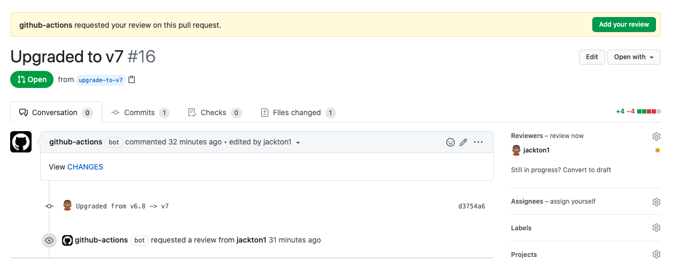

bumpversion
-----------

Usage
-----

#### Sync a project release version number.

Update files that reference a project version with a new release number.

```yaml
...
    steps:
      - uses: actions/checkout@v2
      - name: Bumpversion release version.
        uses: tj-actions/bumpversion@v7.1
          id: bumpversion
          with:
            current_version: '1.0.1'  # Omit to use git tag.
            new_version: '1.0.2'  # Omit when running on a release action.
            paths: |
              README.md
              test/subdir/README.md
      - run: |
        echo "Upgraded from ${{ steps.bumpversion.outputs.old_version }} -> ${{ steps.bumpversion.outputs.new_version }}" 
```


### Recomended usage with [peter-evans/create-pull-request@v3](https://github.com/peter-evans/create-pull-request)

```yaml
name: Update release version.
on:
  release:
    types: [published]


jobs:
  update-version:
    runs-on: ubuntu-latest
    steps:
      - uses: actions/checkout@v2
      - name: Bumpversion release version.
        uses: tj-actions/bumpversion@v7.1
        id: bumpversion
        with:
          pattern: 'tj-actions/bumpversion@'
          paths: |
            README.md
      - name: Create Pull Request
        uses: peter-evans/create-pull-request@v3
        with:
          base: "master"
          title: "Upgraded to ${{ steps.bumpversion.outputs.new_version }}"
          branch: "upgrade-to-${{ steps.bumpversion.outputs.new_version }}"
          commit-message: "Upgraded from ${{ steps.bumpversion.outputs.old_version }} -> ${{ steps.bumpversion.outputs.new_version }}"
          body: "View [CHANGES](https://github.com/${{ github.repository }}/compare/v${{ steps.bumpversion.outputs.old_version }}...v${{ steps.bumpversion.outputs.new_version }})"
          reviewers: "jackton1"
```

Example
-------



Creating a new release `v6.8 -> v7` using the recommended configuration above.

#### BEFORE

`README.md`
```yaml
...
    steps:
      - uses: actions/checkout@v2
      - name: Bumpversion release version.
        uses: tj-actions/bumpversion@v6.8
```

#### AFTER
`README.md`
```yaml
...
    steps:
      - uses: actions/checkout@v2
      - name: Bumpversion release version.
        uses: tj-actions/bumpversion@v7.1
```


Inputs
------

|   Input           |    type       |  required     |  default                | description                                                     |
|:-----------------:|:-------------:|:-------------:|:-----------------------:|:---------------------------------------------------------------:|
| `token`           |  `string`     |    `true`     | `${{ github.token }}`   | 'GITHUB_TOKEN or <br /> a Repo scoped PAT'                             |
| `current_version` |  `string`     |    `false`    |                         | The current project version <br /> (Defualts to: The last git tag)     |
| `new_version`     |  `string`     |    `false`    |                         | The next project version <br /> (Defaults to: The new git tag)         |
| `paths`           |  `array`      |    `true`     |                         | A list of file names to search <br /> and replace versions.            |
| `pattern`         |  `string`     |    `false`    |    `''`                 | The pattern to match the location <br /> that needs to be updated      |


Output
------

|   Output         |    type     |  example              | description                   |
|:----------------:|:-----------:|:---------------------:|:-----------------------------:|
| `new_version`    |  `string`   |    `1.2.1`            |  The current project version |
| `old_version`    |  `string`   |    `1.2.0`            |  The previous project version |


* Free software: [MIT license](LICENSE)

Features
--------

* Updates your readme file with an up to date version of your project based on each release tag.


Credits
-------

This package was created with [Cookiecutter](https://github.com/cookiecutter/cookiecutter).


Report Bugs
-----------

Report bugs at https://github.com/tj-actions/bumpversion/issues.

If you are reporting a bug, please include:

* Your operating system name and version.
* Any details about your workflow that might be helpful in troubleshooting.
* Detailed steps to reproduce the bug.
